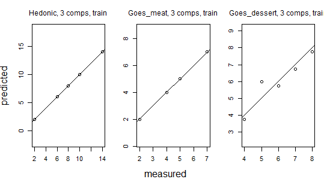
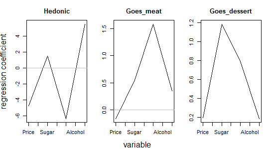
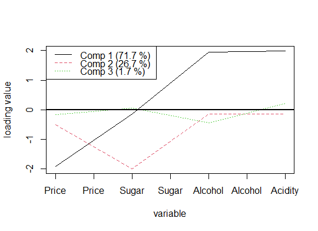

# PLS

## Objectives

PLS is a **prediction** model of Y from X.

- PLS proposes a set of factors for X and Y that can be used to decompose the data tables.

- These factors should explain as much as possible of the link (covariance) between X and Y.

They are called **latent factors**.

------------------------------------------------------------------------

## Conditions of use

- Prediction of Y from linear combinations of the explanatory variables X.

- The number of explanatory variables (*p*) can be large compared with the number of observations (*n*).

- The explanatory variables X may be highly collinear.

PLS regression is often used in chemometrics, medical data analysis or OMIC.

------------------------------------------------------------------------

## Advantages

  - **Multivariate method**: we can predict several explanatory variables (matrix for Y) or just one (vector for Y).

- **Missing data** are handled in the PLS regression algorithm and do not prevent analysis.

- The explanatory variables can be **correlated, even strongly**.

- Can deal with a **large number of explanatory variables**, even be larger than the number of individuals.

------------------------------------------------------------------------

## Limits

- The **choice of the number of latent factors** needs to be determined, usually by cross-validation.

- The complexity introduced by the construction of latent factors.

- The assumption that the relationships between the variables to be explained and the explanatory variables are **linear**.

------------------------------------------------------------------------

## Examples

### Wine tasting (PLS regression, H. Abdi)

<table style="text-align:center">
<caption>
<strong>Data matrix Y of variables to be explained</strong>
</caption>
<tr>
<td colspan="4" style="border-bottom: 1px solid black">
</td>
</tr>
<tr>
<td style="text-align:left">
Wine
</td>
<td>
Hedonic
</td>
<td>
Goes_meat
</td>
<td>
Goes_dessert
</td>
</tr>
<tr>
<td colspan="4" style="border-bottom: 1px solid black">
</td>
</tr>
<tr>
<td style="text-align:left">
1
</td>
<td>
14
</td>
<td>
7
</td>
<td>
8
</td>
</tr>
<tr>
<td style="text-align:left">
2
</td>
<td>
10
</td>
<td>
7
</td>
<td>
6
</td>
</tr>
<tr>
<td style="text-align:left">
3
</td>
<td>
8
</td>
<td>
5
</td>
<td>
5
</td>
</tr>
<tr>
<td style="text-align:left">
4
</td>
<td>
2
</td>
<td>
4
</td>
<td>
7
</td>
</tr>
<tr>
<td style="text-align:left">
5
</td>
<td>
6
</td>
<td>
2
</td>
<td>
4
</td>
</tr>
<tr>
<td colspan="4" style="border-bottom: 1px solid black">
</td>
</tr>
</table>

<table style="text-align:center">
<caption>
<strong>Data matrix X of explanatory variables</strong>
</caption>
<tr>
<td colspan="5" style="border-bottom: 1px solid black">
</td>
</tr>
<tr>
<td style="text-align:left">
Wine
</td>
<td>
Price
</td>
<td>
Sugar
</td>
<td>
Alcohol
</td>
<td>
Acidity
</td>
</tr>
<tr>
<td colspan="5" style="border-bottom: 1px solid black">
</td>
</tr>
<tr>
<td style="text-align:left">
1
</td>
<td>
7
</td>
<td>
7
</td>
<td>
13
</td>
<td>
7
</td>
</tr>
<tr>
<td style="text-align:left">
2
</td>
<td>
4
</td>
<td>
3
</td>
<td>
14
</td>
<td>
7
</td>
</tr>
<tr>
<td style="text-align:left">
3
</td>
<td>
10
</td>
<td>
5
</td>
<td>
12
</td>
<td>
5
</td>
</tr>
<tr>
<td style="text-align:left">
4
</td>
<td>
16
</td>
<td>
7
</td>
<td>
11
</td>
<td>
3
</td>
</tr>
<tr>
<td style="text-align:left">
5
</td>
<td>
13
</td>
<td>
3
</td>
<td>
10
</td>
<td>
3
</td>
</tr>
<tr>
<td colspan="5" style="border-bottom: 1px solid black">
</td>
</tr>
</table>

### Soil organic carbon content (Statistics with R, P-A Cornillon et. al)

<table style="text-align:center">
<caption>
<strong>Extract of the data matrix (1 variable to be explained CO, explanatory variables X of wavelengths</strong>
</caption>
<tr>
<td colspan="10" style="border-bottom: 1px solid black">
</td>
</tr>
<tr>
<td style="text-align:left">
CO
</td>
<td>
X400
</td>
<td>
X401
</td>
<td>
X402
</td>
<td>
X403
</td>
<td>
X404
</td>
<td>
X405
</td>
<td>
X406
</td>
<td>
X407
</td>
<td>
X408
</td>
</tr>
<tr>
<td colspan="10" style="border-bottom: 1px solid black">
</td>
</tr>
<tr>
<td style="text-align:left">
1.140
</td>
<td>
0.076
</td>
<td>
0.077
</td>
<td>
0.078
</td>
<td>
0.083
</td>
<td>
0.083
</td>
<td>
0.082
</td>
<td>
0.081
</td>
<td>
0.082
</td>
<td>
0.084
</td>
</tr>
<tr>
<td style="text-align:left">
1.780
</td>
<td>
0.081
</td>
<td>
0.082
</td>
<td>
0.082
</td>
<td>
0.087
</td>
<td>
0.090
</td>
<td>
0.089
</td>
<td>
0.083
</td>
<td>
0.089
</td>
<td>
0.093
</td>
</tr>
<tr>
<td style="text-align:left">
1.200
</td>
<td>
0.081
</td>
<td>
0.083
</td>
<td>
0.084
</td>
<td>
0.082
</td>
<td>
0.084
</td>
<td>
0.087
</td>
<td>
0.088
</td>
<td>
0.091
</td>
<td>
0.093
</td>
</tr>
<tr>
<td style="text-align:left">
1.440
</td>
<td>
0.095
</td>
<td>
0.094
</td>
<td>
0.096
</td>
<td>
0.104
</td>
<td>
0.104
</td>
<td>
0.102
</td>
<td>
0.103
</td>
<td>
0.102
</td>
<td>
0.103
</td>
</tr>
<tr>
<td style="text-align:left">
1.150
</td>
<td>
0.098
</td>
<td>
0.094
</td>
<td>
0.089
</td>
<td>
0.096
</td>
<td>
0.102
</td>
<td>
0.104
</td>
<td>
0.098
</td>
<td>
0.099
</td>
<td>
0.100
</td>
</tr>
<tr>
<td style="text-align:left">
1.220
</td>
<td>
0.087
</td>
<td>
0.092
</td>
<td>
0.095
</td>
<td>
0.097
</td>
<td>
0.095
</td>
<td>
0.093
</td>
<td>
0.100
</td>
<td>
0.100
</td>
<td>
0.098
</td>
</tr>
<tr>
<td colspan="10" style="border-bottom: 1px solid black">
</td>
</tr>
</table>

# PLS Algorithm(s)

The data are normalised (centred and reduced for each variable in the Y table and each variable in the X table).

### Principle

We are looking for both a vector formed by a linear combination of the
columns of X and a vector formed by a linear combination of the columns
of Y :

$$t = \sum_{l=1}^{p} X_{.l} w_l, \\ u = \sum_{k=1}^{m} Y_{.k} c_k$$

where the weight vectors *w* = (*w*<sub>1</sub>,…,*w*<sub>*p*</sub>)' and *c* = (*c*<sub>1</sub>,…,*c*<sub>*p*</sub>)′ are normalized.

$$\sum_{l=1}^{p}w_{l}^{2} = 1, \\ \sum_{k=1}^{m}c_{k}^{2} =1$$

and such that the covariance $\left( = \sum_{i=1}^{n} t_i u_i \right)$ is maximum.

Once this first factor has been constructed, its information is subtracted from the X and Y data matrices and the process is repeated for the subsequent factors.

------------------------------------------------------------------------

## NIPALS Algorithm

### Steps for calculating the first factor

- Initialisation: *E* = *X*<sup>*normed*</sup>,     *F* = *Y*<sup>*normed*</sup>, the values of the vector
    *u* = (*u*<sub>1</sub>,…,*u*<sub>*n*</sub>)′ are arbitrary.

- Steps

  - Computation of the weight vector
        *w* = (*w*<sub>1</sub>,…,*w*<sub>*p*</sub>)= calculate the linear combination of the rows of *E* as follows
        $\sum_{i=1}^{n} E_{i.} u_i$, normalise the result.

  - Computation of the score vector
        *t* = (*t*<sub>1</sub>,…,*t*<sub>*n*</sub>)= calculate the linear combination of the columns of *E* as follows
        $\sum_{j=1}^{p} E_{.j} w_j$, normalise the result.

  - Computation of the weight vector
        *c* = (*c*<sub>1</sub>,…,*c*<sub>*m*</sub>)= calculate the linear combination of the rows of *F* as follows
        $\sum_{i=1}^{n} F_{i.} t_i$, normalise the result.

  - Computation of the score vector
        *u* = (*u*<sub>1</sub>,…,*u*<sub>*n*</sub>)= calculate the linear combination of the columns of *F* as follows
        $\sum_{j=1}^{m} F_{.j} c_j$, normalise the result.

- Iterate until the vectors converge.

### Steps for calculating the second factor

- Subtracting information from the first factor

  - Compute the coefficient of slope $b = \sum_{i=1}^{n} t_i u_i$ of the regression of *u* on *t*. (Note that this coefficient is equivalent to a covariance).

  - Replace each column of E with the residuals from the regression of each variable in *E* (in column) as a function of *t*. 
  Let *E* = (*I*−*t* *t*<sup>*T*</sup>) *E*

  - Similarly, subtract the information of the first factor from
        *F*. Let *F* = (*I*−*b* *t* *t*<sup>*T*</sup>) *F*.

- Run the iterative algorithm with the new values of *E* and *F* (normalised) to find the second factor.

------------------------------------------------------------------------

## Algorithm using Matrix Decomposition

- First factor: We show that the components *t*, *u* and the weight
    vectors *w*, *c* are obtained as the first eigenvector of the
    following matrices 
    *E* *E*<sup>*T*</sup>*F* *F*<sup>*T*</sup>,
    *F* *F*<sup>*T*</sup>*E* *E*<sup>*T*</sup>,
    *E*<sup>*T*</sup>*F* *F*<sup>*T*</sup>*E*,
    *F*<sup>*T*</sup>*E* *E*<sup>*T*</sup>*F*.

- Second factor: as with the nipals algorithm, we subtract the information from the first factor using the residuals.

------------------------------------------------------------------------

## Computation of the Loadings for X

- For each vector/factor *t*, we calculate the projection of *E* onto *t*. This produces loadings which are used to quantify the information in the initial table *X* represented/explained by each factor.

- In Abdi’s article

X Loadings

    ##         [,1]    [,2]    [,3]
    ## [1,] -1.8706 -0.6845 -0.1796
    ## [2,]  0.0468 -1.9977  0.0829
    ## [3,]  1.9547  0.0283 -0.4224
    ## [4,]  1.9874  0.0556  0.2170

Variances

    ## [1] 11.272  4.463  0.265

Percentage of variance for each component

    ## [1] 0.7045 0.2790 0.0165

------------------------------------------------------------------------

## Computation of the Scores for each *t* vector

In Abdi’s article, T= X scores

    ##        [,1]   [,2]   [,3]
    ## [1,]  0.454 -0.466  0.572
    ## [2,]  0.540  0.494 -0.463
    ## [3,]  0.000  0.000  0.000
    ## [4,] -0.430 -0.533 -0.530
    ## [5,] -0.563  0.505  0.422

------------------------------------------------------------------------

## Reconstitution of the *X* matrix from *t* vectors (scores) and associated loadings

X scores %*% t(X loadings)

    ##    Price Sugar Alcohol Acidity
    ## 1 -0.632     1   0.632       1
    ## 2 -1.265    -1   1.265       1
    ## 3  0.000     0   0.000       0
    ## 4  1.265     1  -0.632      -1
    ## 5  0.632    -1  -1.265      -1

------------------------------------------------------------------------

## Loadings and Scores of each factor *u* for Y

- For each factor *u*, we compute the projection of *F* onto *u*. This produces loadings which are used to quantify the information in the starting table *Y* represented/explained by each factor.

Y loadings

    ## 
    ## Loadings:
    ##              Comp 1 Comp 2 Comp 3
    ## Hedonic       7.542 -0.410  4.791
    ## Goes_meat     3.996 -1.312 -0.558
    ## Goes_dessert  1.356 -2.615 -0.271
    ## 
    ##                Comp 1 Comp 2 Comp 3
    ## SS loadings      74.7   8.73  23.33
    ## Proportion Var   24.9   2.91   7.78
    ## Cumulative Var   24.9  27.80  35.58


Yscores

    ##   Comp 1 Comp 2  Comp 3
    ## 1  55.96  -5.44  13.063
    ## 2  23.08   3.47 -10.827
    ## 3  -1.36   2.61   0.271
    ## 4 -47.89  -4.58 -12.512
    ## 5 -29.78   3.93  10.005
    ## attr(,"class")
    ## [1] "scores"

------------------------------------------------------------------------

## Prediction of Y

- Instead of studying the multivariate regression of *Y* on *X* , the pls expresses *Y* as a function of the factors *t* :
  - A number *K* of factors *t* is selected to reconstruct *Y*.
  - Each factor *t* is multiplied by its variance (and denoted *t*<sup>\*</sup>), to return to the original units rather than standardised.
  - The *c* weights are used to reconstruct *Y* from the *t*<sup>*</sup>factors (see nipals algorithm).

*Ŷ* = *T*<sub>(*K*)</sub><sup>*</sup>*C*<sub>(*K*)</sub>′

- The loadings of X are used to express the
    *T*<sub>(*K*)</sub><sup>*</sup> matrix of factors as a function of the matrix of initial data *X*.

- Finally, we identify the matrix of coefficients *B*<sub>*p* *l* *s*</sub> which allows us to predict *Y* as a function of *X*: *Ŷ* = *X* *B*<sub>*pls*</sub>.

### PlS Coefficients :

``` r
# Using K=2 factors
```

 
    ##         Hedonic Goes_meat Goes_dessert
    ## Price    -1.250    -0.565    -0.000131
    ## Sugar     0.325     0.687     1.254032
    ## Alcohol   1.207     0.703     0.364195
    ## Acidity   1.426     0.825     0.418149

``` r
# Using K=3 factors
```

    ##         Hedonic Goes_meat Goes_dessert
    ## Price     -4.74    -0.158        0.198
    ## Sugar      1.50     0.550        1.187
    ## Alcohol   -6.32     1.581        0.791
    ## Acidity    5.50     0.350        0.187

### *Y* Prediction

``` r
# Raw Data
```
    ##   Hedonic Goes_meat Goes_dessert
    ## 1      14         7            8
    ## 2      10         7            6
    ## 3       8         5            5
    ## 4       2         4            7
    ## 5       6         2            4


``` r
# Using K=1 factors
```
    ##   Hedonic Goes_meat Goes_dessert
    ## 1   11.09      6.64         6.56
    ## 2   12.39      7.33         6.79
    ## 3    8.00      5.00         6.00
    ## 4    4.36      3.07         5.35
    ## 5    4.16      2.96         5.31

``` r
# Using K=2 factors
```
    ##   Hedonic Goes_meat Goes_dessert
    ## 1   11.30      7.31         7.90
    ## 2   12.21      6.74         5.62
    ## 3    8.00      5.00         6.00
    ## 4    4.55      3.70         6.61
    ## 5    3.93      2.24         3.87
  
``` r
# Using K=3 factors
```
    ##   Hedonic Goes_meat Goes_dessert
    ## 1      14         7         7.75
    ## 2      10         7         5.75
    ## 3       8         5         6.00
    ## 4       2         4         6.75
    ## 5       6         2         3.75

------------------------------------------------------------------------

## Graphical representation of results

-   Predictions based on observations



-   PLS regression coefficients



-   Loadings associated with the matrix X



# Extensions

- Discriminant PLS: consists of a combination of PLS regression and discriminant analysis.

- Non-linear PLS: prior transformations of the data (X) using splines, for example. Use of non-linear combinations to construct PLS
    components

- Sparse PLS for parsimonious data (package *spls* from *R*)

- PLS logistic regression and generalised PLS regression

- Bibliography for this presentation

  - PLS regression, Tenenhaus Michel (book)

  - Statistics with R, Cornillon P-A *et al* (book)

  - Partial Least Squares (PLS) Regression, Abdi Hervé (article)
  - [How the PLS model is calculated](https://learnche.org/pid/latent-variable-modelling/projection-to-latent-structures/how-the-pls-model-is-calculated)
